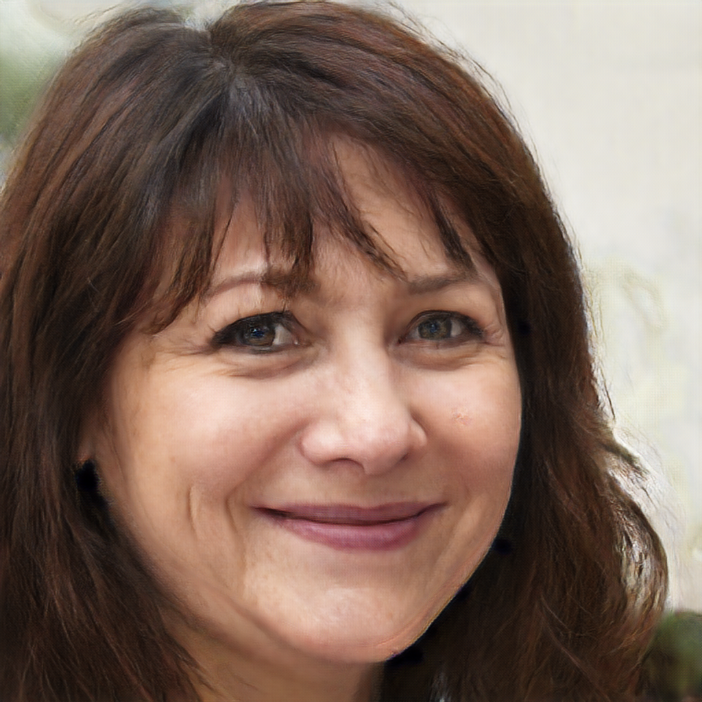
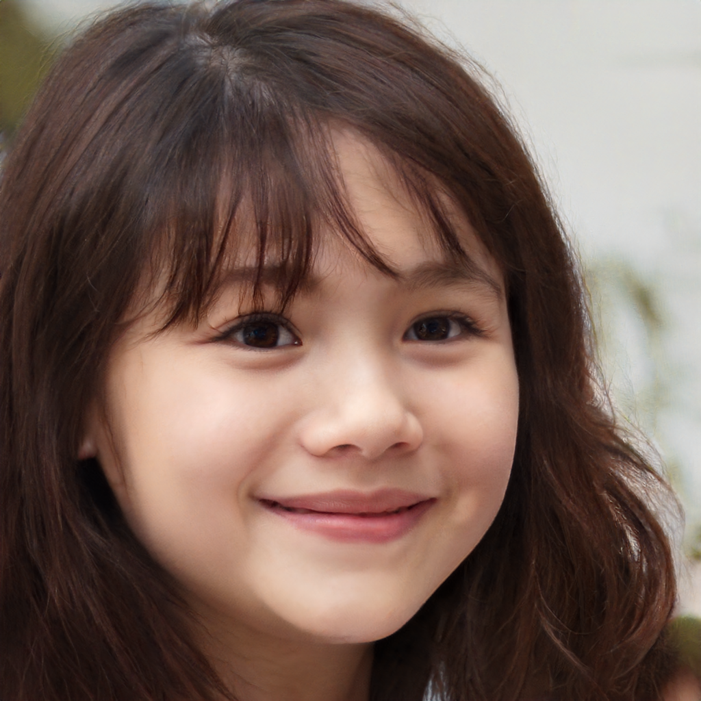
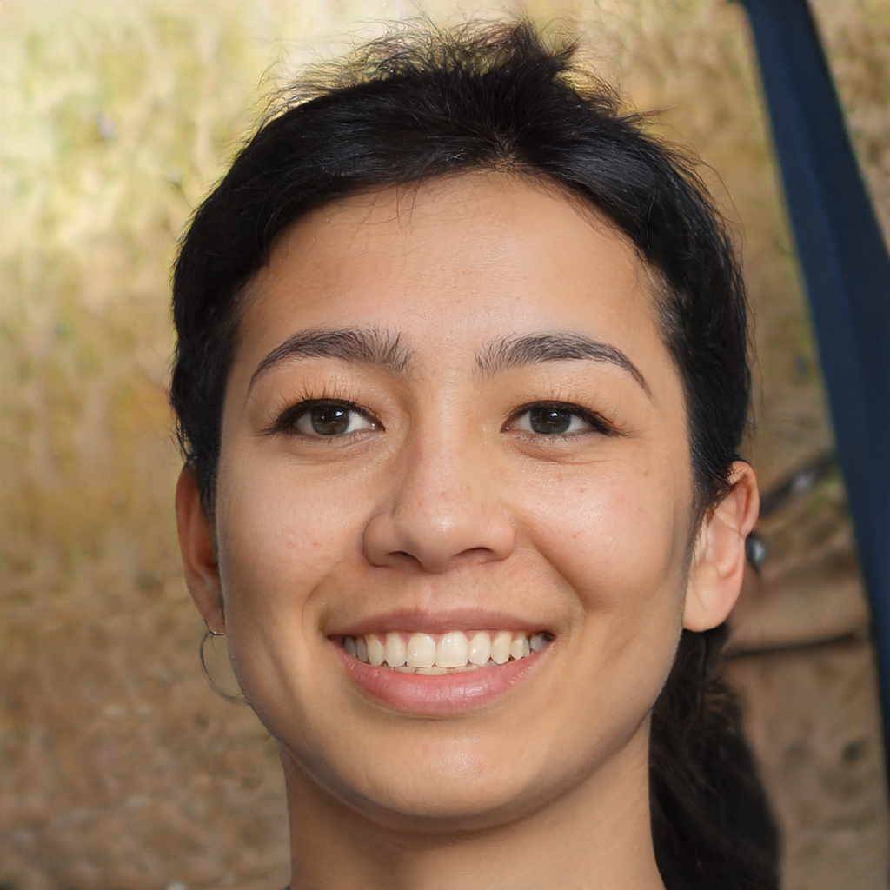
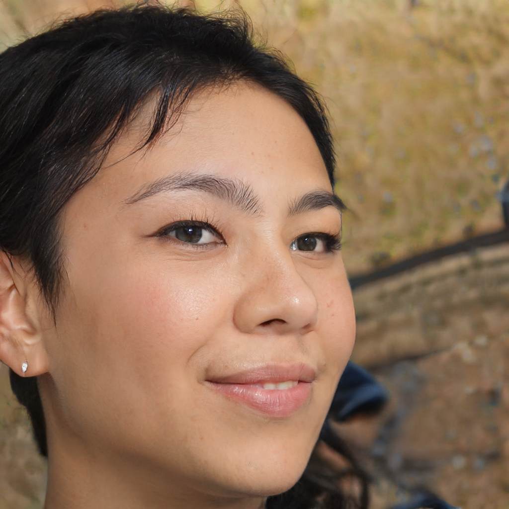
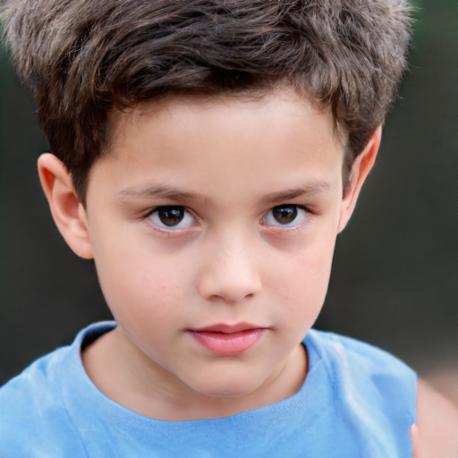
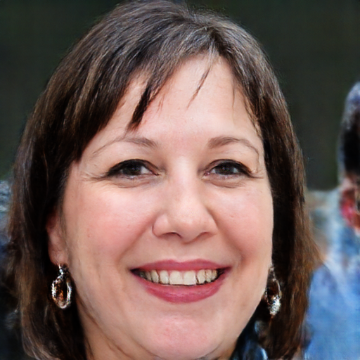
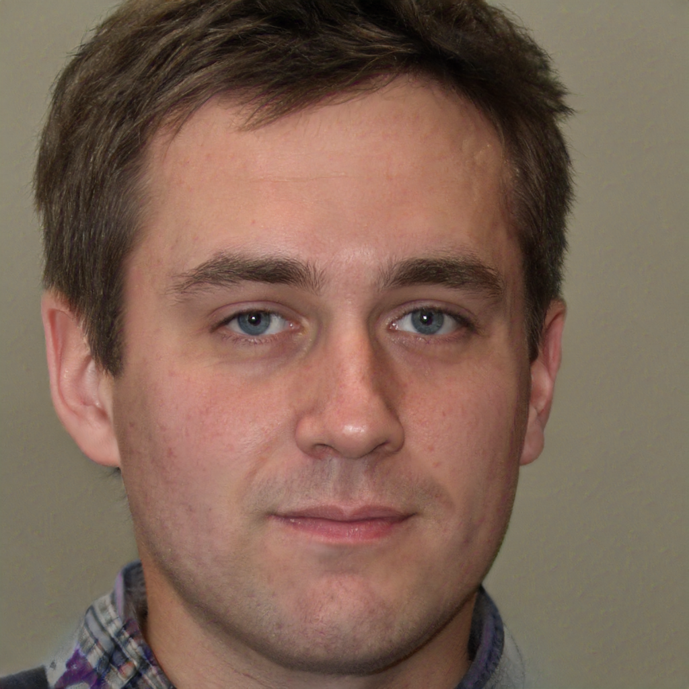
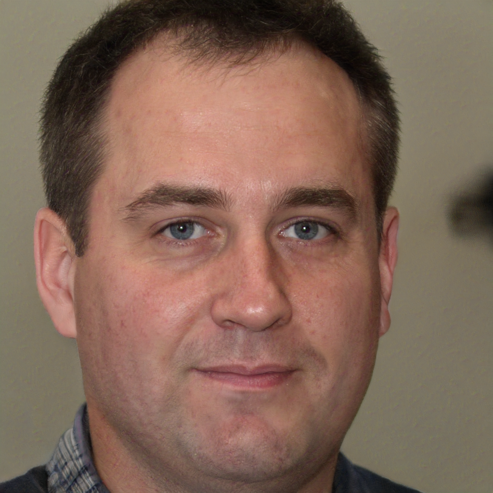
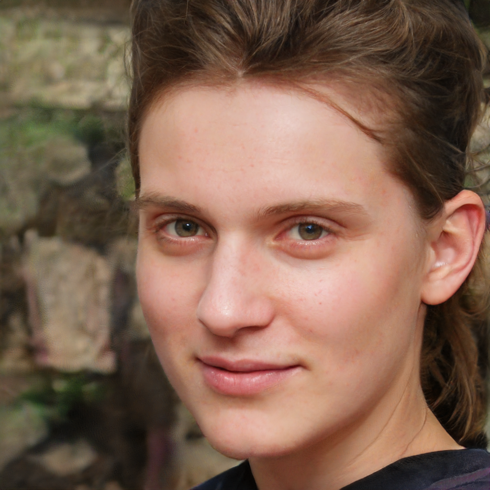
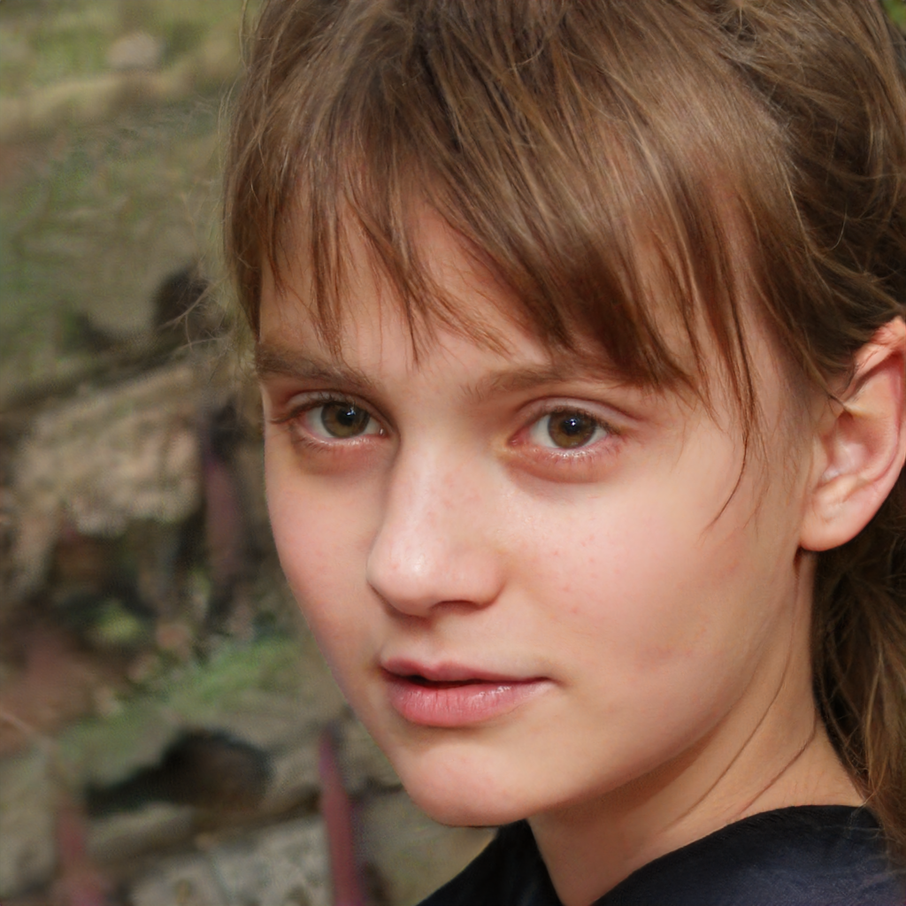

# StyleGAN2 Distillation model

Nnabla implementation of [StyleGAN2 Distillation](https://arxiv.org/abs/2003.03581). 

## To generate the dataset for training 

Download precomputed stylegan2 directions zip file from [here](https://hostb.org/NCM) and unzip the downloaded file. After downloading, dataset can be created by running: 

```
$ python data_generation.py --save-image-path [path to save the images] --attr-delta-path [path to the attribute npy file in the downloaded folder] --weights-path [path to store the stylegan2 pretrained weights] --num-images [number of images to generate] --batch-size [batch-size for single forward pass of the stylegan2 generator] --coeff [for controlling the amount of modification of the attribute] 
```

## To train Pix2PixHD model for the image translation task on the dataset

For training the global generator (trains on 512x512 images):

For single gpu: 

```
python main.py --data-root [path to the dataset]
```

For multiple gpus (say 4):

```
mpirun -N 4 python main.py --data-root
```

After training the global generator, local generator can be trained as: 

For single gpu: 

```
python main.py --fix-global-epoch 20 --d-n-scales 3 --g-n-scales 2 --save-path [path to store ] --load-path [path to trained global generator parameters (h5 file)]
```

For multiple gpus (say 4):

```
mpirun -N 4 python main.py --fix-global-epoch 20 --d-n-scales 3 --g-n-scales 2 --save-path --load-path [path to trained global generator parameters (h5 file)]
```

## For attributes other than those for which precomputed direction is not available

For this, we will need to train a classifier for a give attribute. We chose CelebA-HQ dataset for this purpose. You need to download the CelebA-HQ dataset and the corresponding annotated attributes for that dataset in order to run the following scripts. 

To train a binary classifier for a particular attribute, run: 

```
$ python celeba_classifier.py --num-iters [number of training iterations] --image-size [size of input image]  --batch-size [batch-size of training] --attr-path [path to annotated attribute txt file of CelebA-HQ] --image-dir [path to the folder containing CelebA-HQ images] --attribute [one of the 40 attributes (case sensitive)] --init-lr [initial learning rate] --lr-step-factor [Multiplicative Factor for the learning rate] --lr-step-iter [Iterations after which to apply the learning rate factor] --save-param-step [parameter saving iteration step] --val-step [iteration interval after which evaluate validation set accuracy to be calculated] --model-save-path [path to save the weights of the classifier]
```

After the classifier has been trained, the attribute manipulation direction in the W-space of stylegan2 can be generated by running as follows:

```
$ python generate_attribute_direction.py --classifier-weight-path [path to the trained classifier from above mentioned script] --weights-path [path to store the stylegan2 pretrained weights]  --batch-size [batch-size for single forward pass of the stylegan2 generator] --num-images [number of images to generate in order to calculate the direction]
```

After the attribute manipulation direction has been generated, the dataset can be generated in the same manner as done with pre-computed direction by running: 

```
$ python data_generation.py --save-image-path [path to save the images] --attr-delta-path [path to the attribute npy file] --weights-path [path to store the stylegan2 pretrained weights] --num-images [number of images to generate] --batch-size [batch-size for single forward pass of the stylegan2 generator] --coeff [for controlling the amount of modification of the attribute] 
```

## Results

### Age 

| Old | Young|
|:-----:|:-----:|
|||

### Yaw  

| | |
|:-----:|:-----:|
|||

### Face Morphing

| Facial structure | Skin color and texture | Morphed generation|
|:-----:|:-----:|:-----:|
||||

### Attractive  

| More attractive | Less attractive |
|:-----:|:-----:|
|||

### Bangs 

| Without Bangs | With Bangs|
|:-----:|:-----:|
|||


## Note

All the 40 attributes of CelebA will not work as the data generation process depends on the random generation of a pre-trained stylegan2 model. So if a particular attribute is not generated sufficiently by a stylegan2 model, then the attribute manipulation direction in the stylegan2 latent space cannot be learnt. 

## References
[https://github.com/EvgenyKashin/stylegan2-distillation](https://github.com/EvgenyKashin/stylegan2-distillation)        
[StyleGAN2 Distillation for Feed-forward Image Manipulation](https://arxiv.org/abs/2003.03581)

